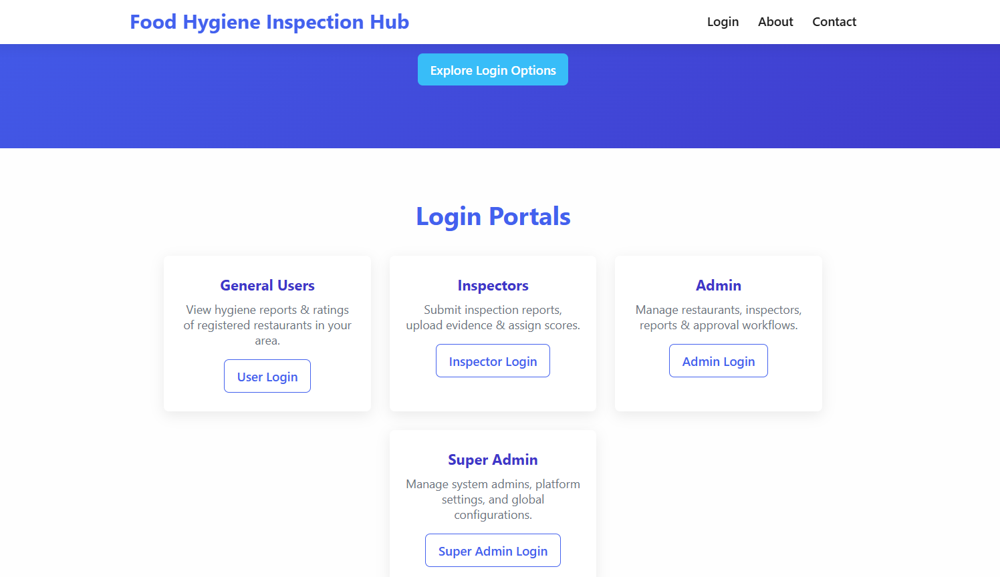
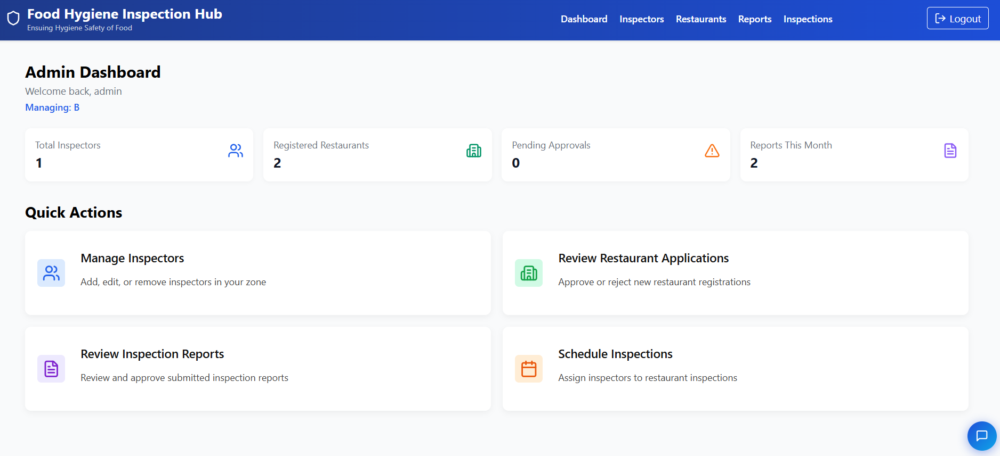
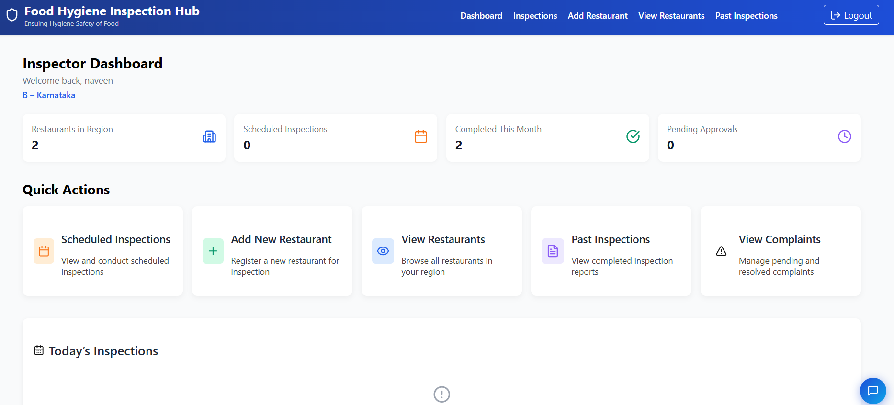
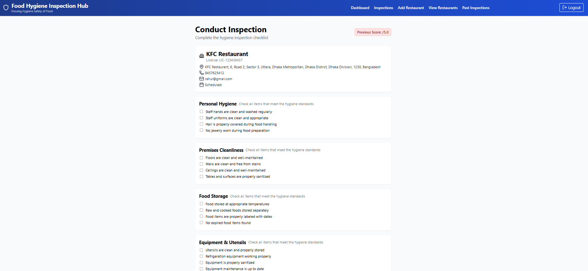
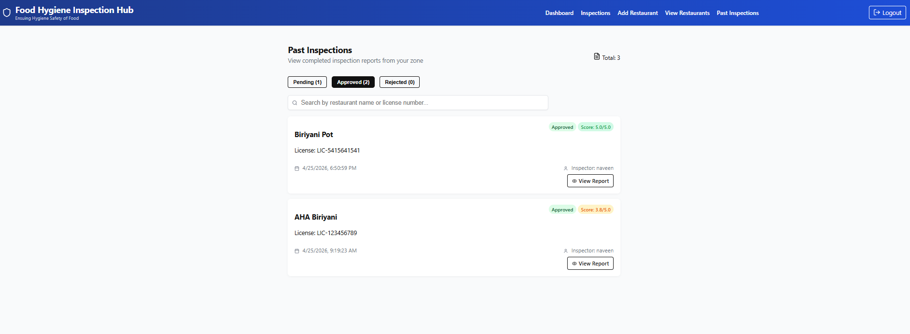
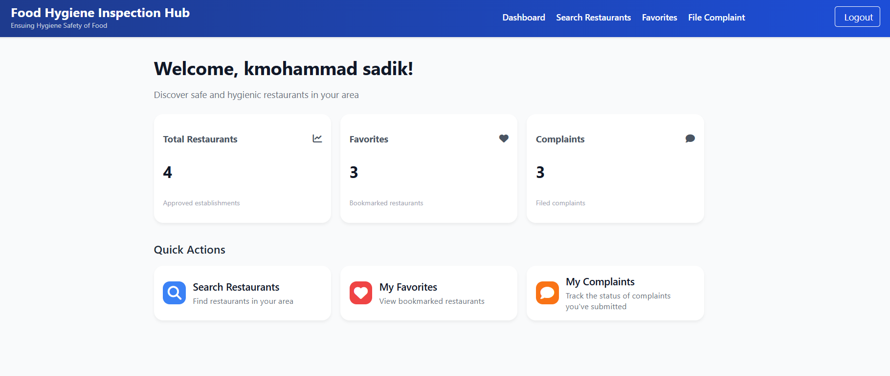

# 🍽️ Food Hygiene Inspection and Reporting Platform


---

## 🔍 Overview

The **Food Hygiene Inspection and Reporting Platform (FHIR)** is a production-grade full-stack web application that digitizes the entire food safety inspection lifecycle — from restaurant registration and scheduled inspections to AI-powered hygiene scoring, PDF report generation, and public transparency reporting.

The platform serves **five roles**: Super Admin, Admin, Inspector, Restaurant Owner, and Public User — each with their own portal, dedicated dashboard, and tightly scoped permissions.

---

## 🌐 Live Demo

**[https://food-hygiene-and-inspection-platform.onrender.com](https://food-hygiene-and-inspection-platform.onrender.com)**

> ⚠️ Hosted on Render free tier — first load may take ~30 seconds to wake up.

---

## 💡 Why I Built This

Traditional food hygiene inspection systems are paper-based, slow, and opaque to the public. This platform solves that by:

- Digitizing inspection checklists with a **weighted auto-scoring engine** (0–5 scale)
- Enabling zone-based admin and inspector management
- Giving the public real-time access to restaurant hygiene reports
- Supporting **Cloudinary image evidence uploads** from mobile cameras (WebRTC)
- Using **Gemini 2.5 Flash AI** for complaint triage, severity tagging, and chatbot support
- Automating **license expiry alerts** and compliance monitoring via a background cron sentinel
- Generating **one-click professional PDF reports** from hygiene audits

---

## 👥 User Roles

| Role | Access |
|---|---|
| **Super Admin** | Manages all zone admins across the system |
| **Admin** | Manages inspectors, restaurants, inspections, and reports in their zone |
| **Inspector** | Adds restaurants, conducts inspections, submits audit reports |
| **Restaurant Owner** | Views their own restaurants' hygiene scores and audit history |
| **Public User** | Views approved restaurants, hygiene scores, files complaints |

---

## ⚙️ Features

### 🛡️ Super Admin
- Login with hardcoded secure credentials
- Add, edit, delete zone admins
- Monitor admin count across zones

### 👨‍💼 Admin
- Zone-based dashboard with live KPI stats
- Approve or reject restaurant applications
- Schedule inspections — assign inspectors to restaurants with a date
- Review, approve, or reject submitted inspection reports
- Download inspection reports as **professional PDF** (Puppeteer)
- Auto-email notifications to inspectors on assignment

### 🔍 Inspector
- Add restaurants with license details, GPS location, and images
- View today's scheduled inspections
- Conduct **standardized hygiene checklist-based inspections**
- Upload photo evidence via **WebRTC live camera stream** (Cloudinary)
- **Weighted auto-scoring** — real-time score computed from checklist weights
- **Image Quality Guard** — AI-powered blur/darkness detection before upload
- View and download past inspection reports
- Geolocation reverse-geocoding for auto-fill addresses

### 🏪 Restaurant Owner
- Self-register and log in (email-linked to restaurant records)
- View all registered restaurants associated with their account
- Track live hygiene scores and full audit history

### 🙋 Public User
- Register and login
- Browse approved restaurants by zone/region on an **interactive map (Leaflet)**
- View detailed hygiene reports and scores
- Add restaurants to favourites
- File complaints with image evidence
- **AI Chatbot** (HygieneBot — Gemini 2.5 Flash) for FSSAI food safety queries

### 🤖 AI & Automation (Phase 8)
- **Gemini AI Complaint Triage** — auto-tags severity (Low / Medium / High / Critical) and categorises complaint type
- **Weighted Auto-Scoring Engine** — inspectors' checklist answers translate into a reproducible 0–5 hygiene score
- **Background Cron Sentinel** — daily automated check for license expiry and sends email alerts
- **Email Notification Service** — nodemailer-based service for inspection assignments and alerts

---

## 🏗️ Tech Stack

| Layer | Technology |
|---|---|
| **Backend** | Node.js + Express.js |
| **Templating** | EJS (Server-Side Rendering) |
| **Frontend (Chatbot)** | React + Vite |
| **Database** | MySQL / Supabase (PostgreSQL) via `mysql2` |
| **Image Storage** | Cloudinary |
| **Authentication** | `express-session` |
| **PDF Generation** | Puppeteer |
| **AI (Chatbot + Triage)** | Google Gemini 2.5 Flash (`@google/generative-ai`) |
| **Email** | Nodemailer (SMTP) |
| **Maps** | Leaflet.js (CDN) |
| **Icons** | Lucide Icons (CDN) |
| **Scheduled Jobs** | `node-cron` |
| **Camera** | WebRTC (`getUserMedia`) |

---

## 📸 Screenshots

### 🏠 Home Page


### 🔐 Login Pages (Admin / Inspector / User)


### 📊 Admin Dashboard


### 🔍 Inspector Dashboard


### 📋 Inspection Checklist


### 📄 Inspection Report


### 🙋 User Dashboard


### 🤖 AI Chatbot (HygieneBot)


---

## 🗄️ Database Schema

Key tables:

| Table | Description |
|---|---|
| `admins` | Zone-based admin accounts |
| `inspectors` | Inspector accounts per zone/region |
| `restaurants` | Restaurant records with approval status + hygiene scores |
| `inspections` | Scheduled inspection records |
| `inspection_reports` | Hygiene reports with JSON checklist data + image paths |
| `users` | Public user accounts |
| `complaints` | User-filed complaints with AI severity tags and image evidence |
| `favorites` | User's favourite restaurants |

> Full schema: [`data/schema.sql`](data/schema.sql)

---

## 🚀 Run Locally

### Prerequisites
- Node.js v18+
- MySQL (local or cloud) **or** a Supabase project
- Cloudinary account (free tier works)
- Google AI Studio API key (for Gemini)
- SMTP email credentials (Gmail app password recommended)

### 1. Clone the repository
```bash
git clone https://github.com/Sadikcserymec077/Food-Hygiene-and-Inspection-platform.git
cd Food-Hygiene-and-Inspection-platform
```

### 2. Install dependencies
```bash
npm install
```

### 3. Set up environment variables

Create a `.env` file in the root directory:

```env
# Database
DB_HOST=localhost
DB_USER=root
DB_PASS=your_mysql_password
DB_NAME=food_hygiene_db

# Cloudinary
CLOUDINARY_CLOUD_NAME=your_cloud_name
CLOUDINARY_API_KEY=your_api_key
CLOUDINARY_API_SECRET=your_api_secret

# Google Gemini AI
GEMINI_API_KEY=your_gemini_api_key

# Email (Nodemailer / Gmail)
EMAIL_USER=your_email@gmail.com
EMAIL_PASS=your_gmail_app_password

# Session
SESSION_SECRET=your_random_secret_string
```

### 4. Set up the database

```sql
CREATE DATABASE food_hygiene_db;
```
Then import [`data/schema.sql`](data/schema.sql) in MySQL Workbench or via CLI:
```bash
mysql -u root -p food_hygiene_db < data/schema.sql
```

### 5. Start the server
```bash
npm run dev
```
> Server runs at `http://localhost:5000`

### 6. (Optional) Start the React Chatbot frontend
```bash
cd frontend
npm install
npm run dev
```
> Frontend runs at `http://localhost:5173`

---

## 🔐 Default Login Credentials

| Role | URL | Email | Password |
|---|---|---|---|
| Super Admin | `/superadmin/login` | `superadmin@gmail.com` | `pass123` |
| Admin | `/adminLogin` | *(created by Super Admin)* | *(set by Super Admin)* |
| Inspector | `/inspectorLogin` | *(created by Admin)* | *(set by Admin)* |
| Owner | `/owner/login` | *(email must match restaurant record)* | *(self-registered)* |
| User | `/userSignup` | *(self-register)* | — |

---

## 🔒 Security Notes

- Passwords are stored in plaintext (for demo purposes) — **hash with bcrypt before production**
- Session secret should be a long random string stored in `.env`
- Cloudinary and Gemini credentials must never be committed to Git (already in `.gitignore`)
- CORS and rate-limiting should be added before deploying to production

---

## 🏗️ Architecture

```
Public User / Admin / Inspector / Owner / Super Admin
                    ↓
         Express.js Server (port 5000)
                    ↓
     ┌──────────────────────────────────┐
     │  EJS Templates (Server-Side UI)  │
     │  REST API Routes (per role)      │
     └──────────────────────────────────┘
                    ↓
     ┌──────────────────────────────────┐
     │   MySQL / Supabase (mysql2)      │
     └──────────────────────────────────┘
          ↓               ↓              ↓
    Cloudinary      Gemini AI        Nodemailer
  (image storage)  (chat + triage)  (email alerts)
          ↓
     node-cron
  (license sentinel)
```

---

## 📁 Project Structure

```
├── src/
│   ├── routes/          # Express route files per role
│   ├── view/            # EJS templates
│   │   └── partials/    # Reusable header, sidebar, footer, chatbot
│   ├── services/        # PDFService, emailService, sentinelService
│   ├── data/            # inspectionCategories, schema.sql
│   └── config/          # dbConnect.js
├── public/
│   ├── css/             # Stylesheets per page
│   ├── js/              # Client-side scripts (imageQualityGuard.js)
│   └── chatbot/         # React Vite build output
├── frontend/            # React + Vite chatbot source
├── .env                 # Environment variables (not committed)
└── server.js            # App entry point
```

---

## 👨‍💻 Author

**Mohammed Sadiq**
Full Stack Developer

---

## 📄 License

MIT License — feel free to use and modify for educational purposes.